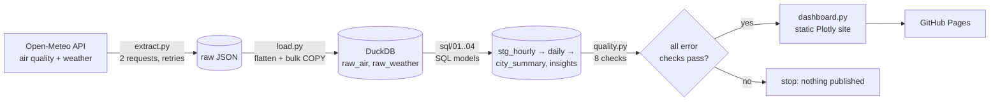

# Tunisia Air Quality Pipeline

An automated data pipeline that tracks air pollution and Saharan dust across **10 Tunisian cities**.
Every morning GitHub Actions pulls fresh data, rebuilds a DuckDB warehouse with SQL models, runs data-quality
checks, and only then republishes the dashboard.

**[Open the live dashboard →](https://naniiic137.github.io/tunisia-air-pipeline/)**


## How it works



| Stage | What it does |
|---|---|
| **Extract** | One request per source covers all 10 cities (hourly PM2.5, PM10, NO₂, ozone, dust, European AQI, temperature, wind, rain). Raw responses are saved before parsing, so any run can be replayed with `--offline`. |
| **Load** | Flattens the API's per-city arrays into long `(city, ts, variable, value)` tables and bulk-loads them into DuckDB. |
| **Transform** | Four SQL models: an hourly staging table (pivot + join), daily figures with WHO-limit flags, a per-city summary and ranking, and two insight tables (weekday/weekend NO₂, Saharan dust episodes). |
| **Quality** | Eight SQL checks: every city present, no duplicate hours, physically plausible values, ≥90% completeness, freshness, full days. Any failed `error` check stops the run. |
| **Publish** | Builds a static dashboard straight from the models and deploys it to GitHub Pages. |

## Findings (snapshot: 30 June – 29 September 2026)

The dashboard updates daily; these are the numbers from the first run.

- **Saharan dust drives particle pollution.** Two big dust episodes (20–27 July and 24–31 August) pushed PM10 over
  the WHO daily limit in several cities at once; on 2 days **all 10 cities** were over it. Across all city-days,
  dust and PM10 correlate at 0.95.
- **Tozeur, on the edge of the Sahara, is the most exposed**: PM10 above the WHO limit on 26% of days, peaking at
  125 µg/m³ on 27 July.
- **Traffic shows up in the data**: nitrogen dioxide is higher on weekdays than at weekends in every city, and Tunis
  has by far the most (7.2 µg/m³ on weekdays vs 5.8 at weekends).

## Design decisions

- **Stateless full refresh.** Open-Meteo keeps 92 days of history, so each run rebuilds the whole window from
  scratch. No state to corrupt, no backfills, and the daily job is idempotent.
- **Long raw tables.** `(city, ts, variable, value)` means adding a new pollutant is a one-line change in
  `extract.py`, with no schema migration.
- **Quality gates publishing.** A bad API response can't reach the public dashboard: the deploy job only runs if every
  `error` check passes.
- **Bulk loading.** Binding ~200k rows from Python took minutes in DuckDB; writing a temporary CSV and using `COPY`
  takes under a second, so a full run (download included) takes a few seconds.

## Run it yourself

```bash
python -m venv .venv
.venv/Scripts/activate          # Windows (on macOS/Linux: source .venv/bin/activate)
pip install -r requirements.txt
set PYTHONPATH=src              # macOS/Linux: export PYTHONPATH=src
python -m airpipe               # extract → load → transform → checks → site/index.html
python -m airpipe --offline     # rerun from the last raw download, no API calls
pytest                          # 12 tests on synthetic data, no network
```

## Project structure

```
src/airpipe/
  extract.py     cities, API URLs, download with retries
  load.py        flatten JSON, bulk load raw tables
  transform.py   runs the SQL models in order
  quality.py     data-quality checks
  dashboard.py   static Plotly dashboard + summary.json
  __main__.py    the pipeline entry point
sql/             01_stg_hourly, 02_daily, 03_city_summary, 04_insights
tests/           tests for every stage
.github/workflows/pipeline.yml   daily schedule + GitHub Pages deploy
```

**Stack:** Python, DuckDB, SQL, Plotly, pytest, ruff, GitHub Actions, GitHub Pages.

## Data and limitations

Weather and air quality data by [Open-Meteo](https://open-meteo.com/), licensed under
[CC BY 4.0](https://creativecommons.org/licenses/by/4.0/). Air quality values come from the Copernicus Atmosphere
Monitoring Service (CAMS) global model and contain modified Copernicus Atmosphere Monitoring Service information.

The CAMS model works on a grid of roughly 40 km. It captures regional pollution and dust events well, but it can
miss very local sources (a single factory, a busy street), and it is modelled data rather than readings from ground
monitoring stations. That's why industrial towns such as Gabès don't stand out as much as they would with local sensors.

Limits used: WHO 2021 air quality guidelines, 24-hour means (PM2.5 15 µg/m³, PM10 45 µg/m³).

The code is released under the [MIT License](LICENSE).
